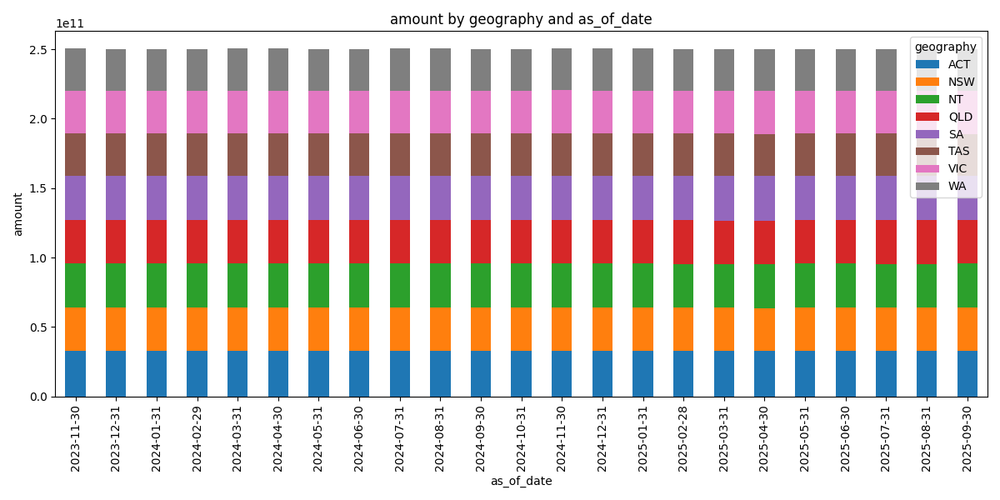
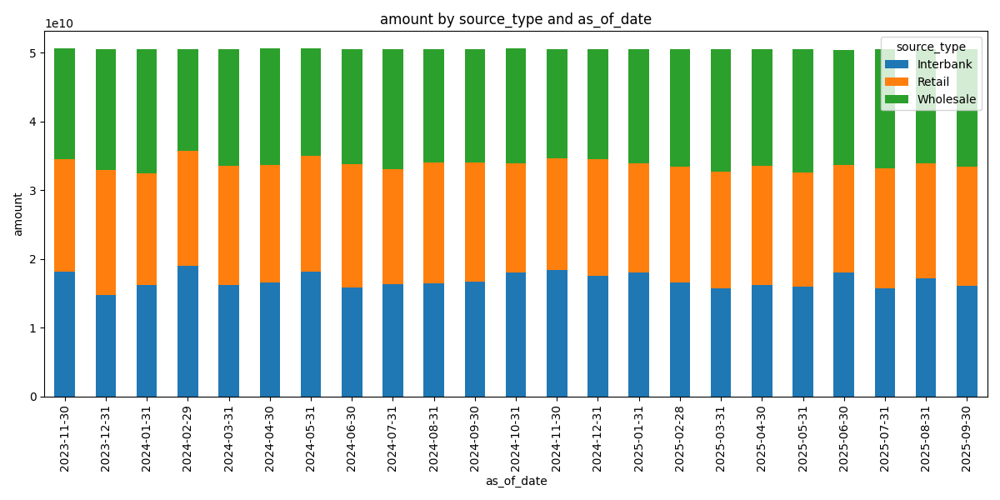
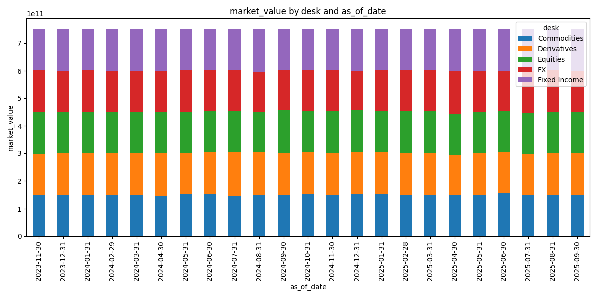

# FakeBank: Synthetic Bank Data Generator

This repository creates a completely synthetic bank for semantic prototyping. It generates realistic, referentially consistent data across credit, market, and liquidity risk domains, with profiling charts and sample data for quick inspection.

## Quick Start
- Run `generate_fakebank_data.py` to generate data and charts.
- All outputs are stored in the `data`, `sample`, and `summary` folders.

## Sample Data
- [Sample Customers](sample/customers_sample.csv)
- [Sample Loans](sample/loans_sample.csv)
- [Sample Loan Applications](sample/loan_applications_sample.csv)
- [Sample Write Offs](sample/write_offs_sample.csv)
- [Sample Customer Interactions](sample/customer_interactions_sample.csv)
- [Sample Loan Securities](sample/loan_securities_sample.csv)
- [Sample Liquidity Positions](sample/liquidity_positions_sample.csv)
- [Sample Funding Sources](sample/funding_sources_sample.csv)
- [Sample Liquidity Metrics](sample/liquidity_metrics_sample.csv)
- [Sample Liquidity Events](sample/liquidity_events_sample.csv)
- [Sample Market Positions](sample/market_positions_sample.csv)
- [Sample Market Risk Metrics](sample/market_risk_metrics_sample.csv)
- [Sample Instrument Prices](sample/instrument_prices_sample.csv)
- [Sample Market Events](sample/market_events_sample.csv)

## Profiling Charts
Below are example images from the `summary` folder:

### Credit Risk

### Liquidity Risk

### Market Risk

---

For more details, see the data specs in the `specs` folder.
