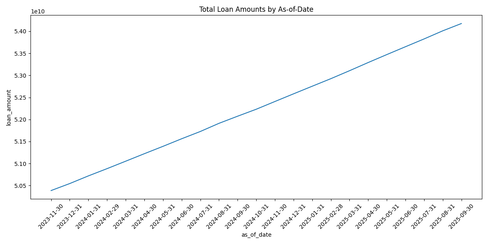
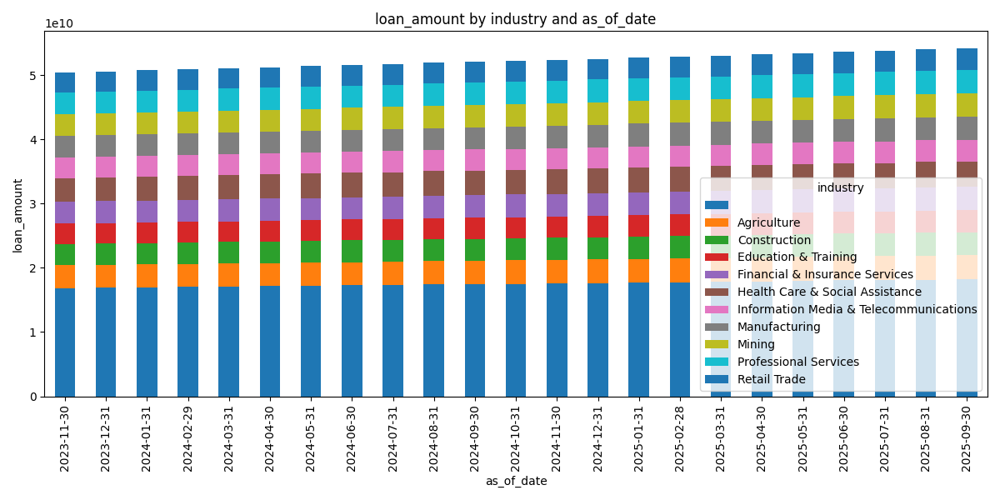
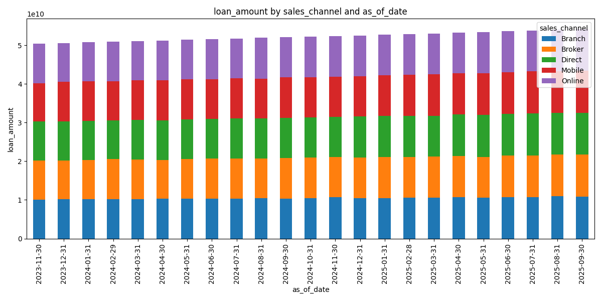
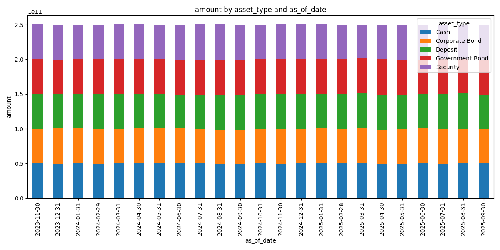
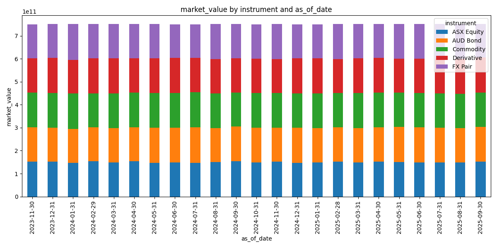

# FakeBank: Data Dictionary

This repository contains a synthetic bank dataset (credit, market, liquidity) and metricated policy documents. The table below is a data dictionary summarising the generated Parquet tables in `data/` and the policy documents in `policies/` with links to the expected S3 locations and the authoritative spec in `specs/`.

Notes:
- Public-style object URLs (region us-east-1) are shown in the table below. Base URL used:
	https://fakebankdata.s3.us-east-1.amazonaws.com/
- Data files are under https://fakebankdata.s3.us-east-1.amazonaws.com/data/ and policies under https://fakebankdata.s3.us-east-1.amazonaws.com/policies/
- Local spec files live in the `specs/` folder (e.g., `specs/credit_risk.md`).

## Data tables

| Table / File | S3 object (expected) | Spec (local) | Short description |
|---|---|---|---|
| customers.parquet | https://fakebankdata.s3.us-east-1.amazonaws.com/data/customers.parquet | specs/customer.md | Customer master: demographics, segment, geography, customer_since. |
| loans.parquet | https://fakebankdata.s3.us-east-1.amazonaws.com/data/loans.parquet | specs/credit_risk.md | Core loan panel snapshots by `as_of_date`: balances, EAD, RWA, credit & LGD ratings, provisioning, collateral, origination/maturity and financials. |
| loan_applications.parquet | https://fakebankdata.s3.us-east-1.amazonaws.com/data/loan_applications.parquet | specs/credit_risk.md | Loan application events with status, requested amount and product type. |
| write_offs.parquet | https://fakebankdata.s3.us-east-1.amazonaws.com/data/write_offs.parquet | specs/credit_risk.md | Records of write-offs linked to loans with reason and amount. |
| customer_interactions.parquet | https://fakebankdata.s3.us-east-1.amazonaws.com/data/customer_interactions.parquet | specs/customer.md | Unstructured/text interactions (phone, email, branch, chat) for customers; useful for ML/text analytics. |
| loan_securities.parquet | https://fakebankdata.s3.us-east-1.amazonaws.com/data/loan_securities.parquet | specs/credit_risk.md | Collateral/security table linked to loans with security_type, value, lien type and address. |
| liquidity_positions.parquet | https://fakebankdata.s3.us-east-1.amazonaws.com/data/liquidity_positions.parquet | specs/liquidity_risk.md | Bank-level and customer-level liquidity positions by `as_of_date`, asset types, amounts and maturities. |
| funding_sources.parquet | https://fakebankdata.s3.us-east-1.amazonaws.com/data/funding_sources.parquet | specs/liquidity_risk.md | Funding sources panel (interbank, retail, wholesale) with amounts and cost of funds. |
| liquidity_metrics.parquet | https://fakebankdata.s3.us-east-1.amazonaws.com/data/liquidity_metrics.parquet | specs/liquidity_risk.md | Monthly liquidity KPIs (LCR, NSFR, cash inflows/outflows) per `as_of_date`. |
| liquidity_events.parquet | https://fakebankdata.s3.us-east-1.amazonaws.com/data/liquidity_events.parquet | specs/liquidity_risk.md | Liquidity event log (stress, withdrawals, deposits) with descriptive details. |
| market_positions.parquet | https://fakebankdata.s3.us-east-1.amazonaws.com/data/market_positions.parquet | specs/market_risk.md | Trading book positions by `as_of_date`: desks, instruments, notional and market value. |
| market_risk_metrics.parquet | https://fakebankdata.s3.us-east-1.amazonaws.com/data/market_risk_metrics.parquet | specs/market_risk.md | Position-level market risk metrics (VaR, SVaR, expected shortfall, volatility). |
| instrument_prices.parquet | https://fakebankdata.s3.us-east-1.amazonaws.com/data/instrument_prices.parquet | specs/market_risk.md | Time series of instrument prices across `as_of_date` for instruments used in market positions. |
| market_events.parquet | https://fakebankdata.s3.us-east-1.amazonaws.com/data/market_events.parquet | specs/market_risk.md | Market event log with shocks, news and regulatory events. |

## Policies and governance documents

| Policy document | S3 object (expected) | Local file | Short description |
|---|---|---|---|
| Capital Adequacy Framework | https://fakebankdata.s3.us-east-1.amazonaws.com/policies/Capital+Adequacy+Framework.md | policies/Capital Adequacy Framework.md | Metricated capital policy: CAR calculation, RWA aggregation, internal limits and escalation triggers. |
| Credit Risk Management Framework | https://fakebankdata.s3.us-east-1.amazonaws.com/policies/Credit+Risk+Management+Framework.md | policies/Credit Risk Management Framework.md | Credit policy mapped to dataset fields: PD/LGD migration, provisioning, concentration limits and reporting KPIs. |
| Liquidity Risk Framework | https://fakebankdata.s3.us-east-1.amazonaws.com/policies/Liquidity+Risk+Framework.md | policies/Liquidity Risk Framework.md | Liquidity policy with LCR/NSFR limits, funding concentration rules and maturity bucket expectations. |
| Market Risk Management Framework | https://fakebankdata.s3.us-east-1.amazonaws.com/policies/Market+Risk+Management+Framework.md | policies/Market Risk Management Framework.md | Market risk policy with desk VaR/SVaR limits, backtesting rules and escalation. |
| Risk Management Framework | https://fakebankdata.s3.us-east-1.amazonaws.com/policies/Risk+Management+Framework.md | policies/Risk Management Framework.md | Overarching risk governance, roles, reporting cadence and aggregated tolerances. |
| Risk Appetite Statement | https://fakebankdata.s3.us-east-1.amazonaws.com/policies/Risk+Appetite+Statement.md | policies/Risk Appetite Statement.md | High-level appetites and measurable KPIs referenced to dataset fields (CAR, LCR, VaR, concentration). |

## How to regenerate data and push to S3

1. Create and activate the virtual environment (Windows PowerShell):

```powershell
& .\venv\Scripts\Activate.ps1
pip install -r requirements.txt
```

2. Generate the synthetic dataset (this creates files under `data/`, `sample/` and `summary/`):

```powershell
python .\generate_fakebank_data.py
```

3. Dry-run upload (lists S3 keys that would be created):

```powershell
python .\upload.py --bucket fakebankdata --dry-run
```

4. Upload to S3 (requires AWS credentials/profile):

```powershell
python .\upload.py --bucket fakebankdata
```

If you'd like the README to include direct clickable HTTP links to S3 objects (e.g., via the AWS console), I can update the S3 object column to include console URLs — tell me which AWS region/account you expect so I can construct the links.

## Profiling charts (examples)

Below are a few example profiling charts generated by `generate_fakebank_data.py` and saved to the `summary/` folder. These help visualise the synthetic dataset and are useful to verify trends and distributions quickly.

### Credit Risk




### Liquidity Risk


### Market Risk


---

If you want additional fields in the dictionary (e.g., row counts, sample sizes, schema previews), say which ones and I'll add them automatically by inspecting generated Parquet files.
